# Heist
Heist is a retired Hack The Box machine with a Hack The Box difficulty rating of easy. Community ratings put it at a medium difficulty.

### Enumeration
The IP of Heist is 10.10.10.149, and I will start off with a full TCP scan:

```
sudo nmap -sS -A -T4 -p- 10.10.10.149 -oA results
```

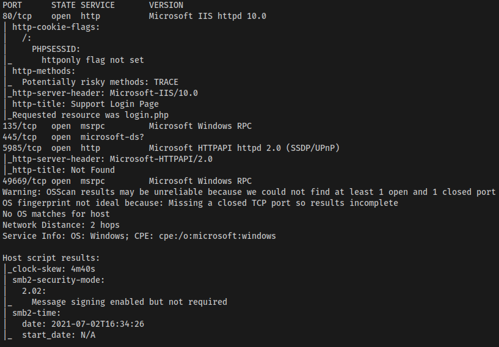

Based on the results of the nmap scan, the following ports/services are found:

```
80 - IIS 10
135 - Microsoft RPC
445 - SMB
5985 - Microsoft HTTPAPI httpd 2.0 (WinRM)
49669 - msrpc
```

A UDP scan found no ports open.

### SMB
I will go after SMB first to determine if there are any vulnerabilities or publicly accessible shares that may contain information. I'll scan the target with nmap using the smb-vuln script to search for SMB vulnerabilities:

```
nmap -script=smb-vuln\* -p445 10.10.10.149
```

It doesn't appear that there are any glaring SMB vulnerabilities on this host:

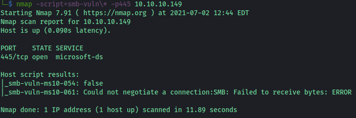

Running enum4linux and trying to connect with a null session does not work either. For now, I will move on to other ports.

### Web
The next service I want to explore is the web server running on the target. Browsing to the target, I'm presented with a login page:

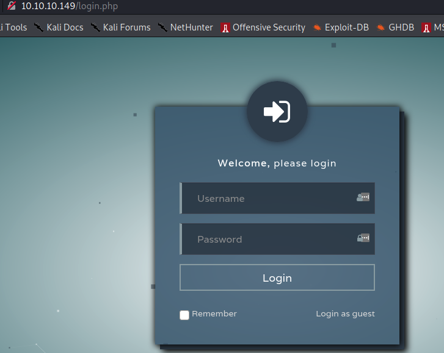

I tried a few SQL injection commands on the login page, but it seems to be smart enough to know you haven't entered an email address. There is an option to log in as a guest user, and when doing so, you are presented with a single support case:

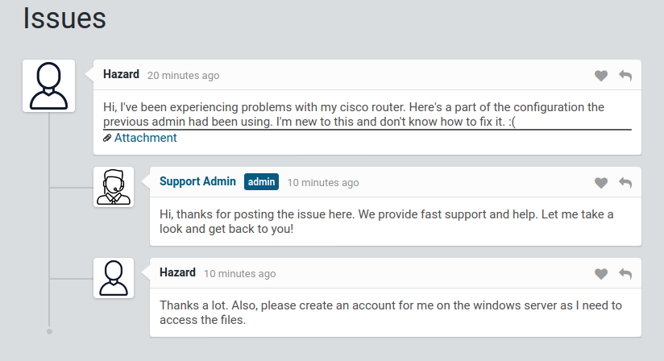

The attachment on the support case is for a Cisco router, and the hashed password values for the device are listed:

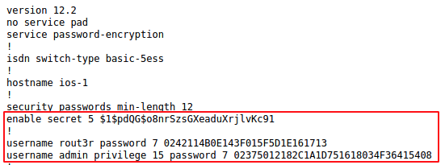

### Cisco Hashes
I found a [website](https://www.ifm.net.nz/cookbooks/passwordcracker.html) that offers online cracking for both type 5 and type 7 Cisco passwords. The type is indicated in the config file lines where the passwords are stored:

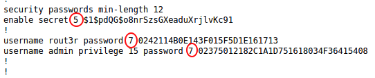

Using the cracking website, the first password cracked is for the rout3r user, which is `$uperP@ssword`. The 2nd hash which is for the admin account is cracked as `Q4)sJu\Y8qz*A3?d`. Unfortunately, it did not seem that whatever wordlist the website uses could find the password for the type 5 password. I used john to crack the type 5 password with the following command:

```
john --format=md5crypt hash.txt --wordlist=/usr/share/wordlists/rockyou.txt  
```

john indicated that the password is likely `stealth1agent`:

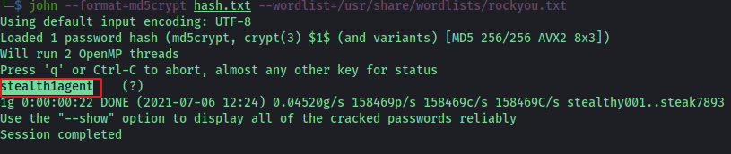

### User Enumeration with lookupsid
Once I had cracked all 3 passwords, I attempted various username/password combinations until I discovered the valid combination of username: hazard, password: `stealth1agent` with smbmap:

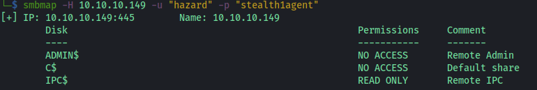

I then used a tool from Impacket called [lookupsid](https://github.com/SecureAuthCorp/impacket/blob/master/examples/lookupsid.py) using the hazard credentials to see what other users existed on the target:

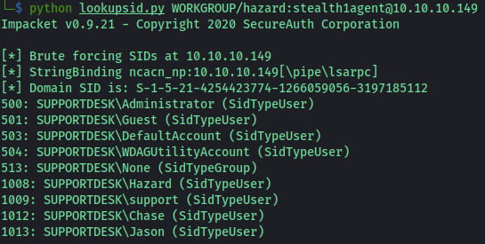

### crackmapexec SMB/WinRM
I now have several more user accounts I can try to use for SMB and WinRM access. I tried all accounts with the 3 passwords discovered for SMB access, and none other than hazard worked (which I already knew). I then tried all accounts/passwords with WinRM, and got a hit back on the user Chase with the password `Q4)sJu\Y8qz*A3?d`:

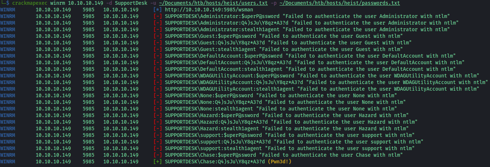

### evil-winrm/User Flag
After identifying that the user Chase has access via WinRM, I used evil-winrm to get a shell as Chase:

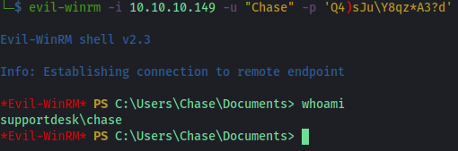

Inside Chase's Desktop folder is a file called todo.txt, as well as the User Flag file:

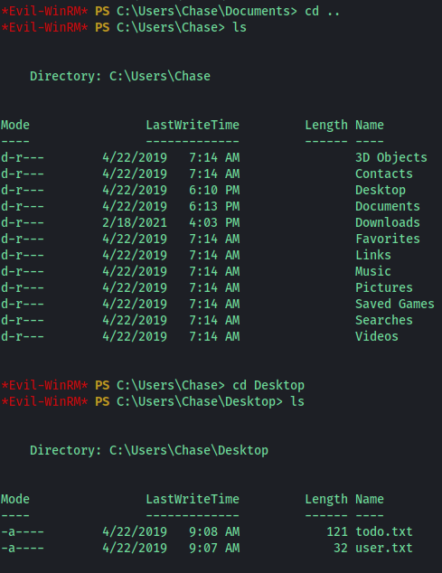

The contents of the todo.txt have a few things that may be of interest:

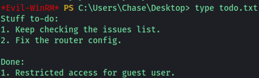

### Privilege Escalation
The first thing I am going to do is to run [winPEAS](https://github.com/carlospolop/privilege-escalation-awesome-scripts-suite/tree/master/winPEAS) against the target. I'll first use PowerShell to download it to the victim from my local machine:

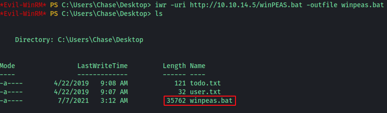

Unfortunately, the Chase user has very limited access to the system and most of the winPEAS checks fail. Checking what groups the user Chase is apart of, it appears that they are only a member of the Remote Management Users and Users group:

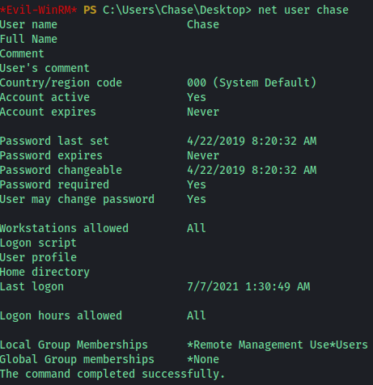

Next, I will use the PowerShell command Get-Process to see what processes are currently running on the target. One process that stands out and is of interest is firefox:

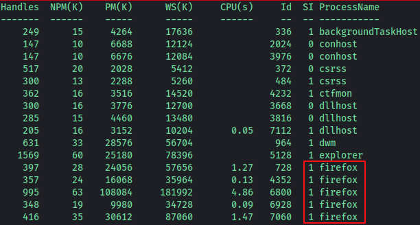

procdump can be used to dump the firefox process and examine it for any kind of passwords that may be stored in memory. I'll download procdump to the target and then perform a procdump on the firefox process with the ID of 728:

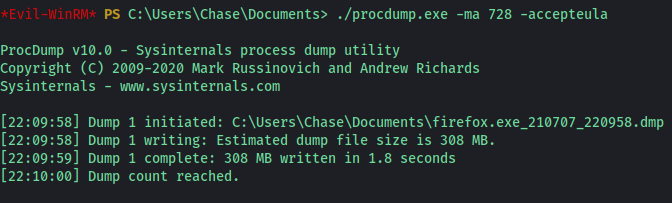

Since the target presumably is the computer the support team uses to log in to the support website, I'll use findstr to search the procdump of firefox for the name of the login field on the support website, which is login_password:

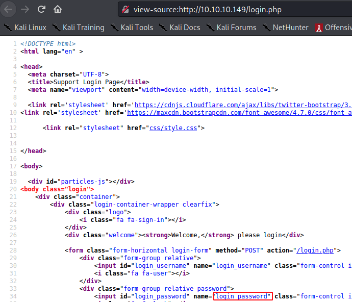

```
findstr "login_password" firefox.exe_210707_220958.dmp
```

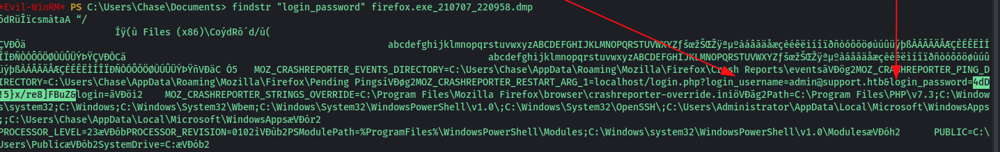

Credentials are found for the admin account in the procdump:

```
admin@support.htb
4dD!5}x/re8]FBuZ
```

I tested the credentials against the support website, and I was able to log in. However, the support admin account doesn't seem to have any additional functionality on the support website. 

### Root
Since I know SMB is open on the target, I will try to use the newly found administrator credentials with [psexec-py](https://github.com/SecureAuthCorp/impacket/blob/master/examples/psexec.py) to see if I can get a shell:

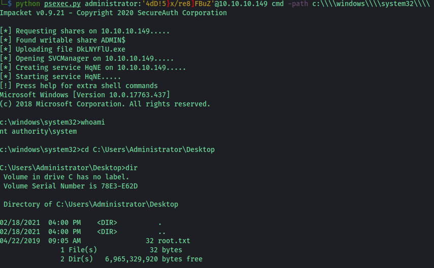

It appears that the password used for the support admin account was used as well for the local administrator account. Unfortunately, password reuse is fairly common and it's critical to try all previously found passwords against a target.

Thanks for reading my write-up for Heist on Hack The Box! Happy Hacking!