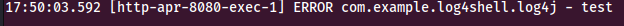

# log4j: As if 2021 couldn't get any worse

*The opinions in this article are my own, and do not represent those of my employer. Additionally, I'd like to say that I am by no means an expert on this topic. I am a security professional striving to learn as much as I can about this vulnerability, as it impacts my day to day job. I'd like to understand it so that I can know how to identify it, and help remediate it and make the world a safer place for all.*

## What is all this log4j fuss about, anyway?

If you work in the technology industry, you've no doubt by now heard of CVE-2021-44228, or more commonly known as log4shell. This vulnerability impacts the product log4j from Apache, which is an extremely popular logging tool. This vulnerability is one of the most severe ones that has the industry has encountered in quite a while, and has a CVSS score of 10.0 (critical). The description on the [cve mitre website](https://cve.mitre.org/cgi-bin/cvename.cgi?name=CVE-2021-44228) describes the vulnerability:

```
Apache Log4j2 2.0-beta9 through 2.12.1 and 2.13.0 through 2.15.0 JNDI features used in configuration, log messages, and parameters do not protect against attacker controlled LDAP and other JNDI related endpoints. An attacker who can control log messages or log message parameters can execute arbitrary code loaded from LDAP servers when message lookup substitution is enabled.
```

Unfortunately, there is an overwhelming amount of applications running the vulnerable versions of log4j. There is a [GitHub repository](https://github.com/cisagov/log4j-affected-db/blob/develop/SOFTWARE-LIST.md) where the community is tracking what applications use log4j, as well as if they have been deemed affected or unaffected. In addition, the repo includes any official press releases from companies that were known to be using log4j regarding whether they were vulnerable or not.

## Technical Details / Exploit Demo

One of the main reasons this vulnerability is so severe is the fact of how trivial it is to exploit. A variety of known vulnerable injection points are circulating the Internet, making it easy for an attacker to start probing applications. Numerous PoC repos are being created on GitHub as well, making it very easy for functional code to fall in to the wrong hands. Before I go in to demoing how to exploit a vulnerable application, I want to describe how the vulnerability works a bit more.

Hardik Shah and Sean Gallagher wrote [a very in depth article](https://news.sophos.com/en-us/2021/12/17/inside-the-code-how-the-log4shell-exploit-works/) on how the underlying code is vulnerable. I'd encourage you to read it to gain a deeper understanding of this vulnerability. Sophia Harrison at Huntress [wrote a consolidated explanation of the vulnerability](https://www.huntress.com/blog/the-year-from-hell-plus-log4shell-a-tradecraft-tuesday-recap). At the core of the vulnerability is the usage of Java Naming and Directory Interface (JNDI) within log4j. JNDI retrieves Java classes and objects, and can use some common protocols such as LDAP and DNS to pull that information from external sources. An attacker can host a malicious Java class with their payload on a server they control, which will then be executed by the vulnerable application.

This photograph [from an article by Sean Gallagher](https://news.sophos.com/en-us/2021/12/12/log4shell-hell-anatomy-of-an-exploit-outbreak/) nicely summarizes how a normal log4j transaction works, and then shows how an attacker can leverage this vulnerability:


So now that we (hopefully) have a little bit of a better understanding of how the vulnerability works, let's take a look at a sample vulnerable application and see just how bad it is. There is a [repo on GitHub](https://github.com/kozmer/log4j-shell-poc) that contains a PoC exploit script that can be used to exploit vulnerable applications. It also contains a vulnerable application via a Dockerfile, so you can safely test the exploit script in a local environment. I cloned the repo and set up the Docker image, and pulled it up in a web browser to see what it looked like:


There are many things that an attacker can do with a vulnerable application. Some of the more common things being seen are installing cryptominers, dumping environment variable secrets, and more. The PoC exploit script is set up to host a malicious Java class which will start a reverse shell on port 9001. Once the attack succeeds, we should have a reverse shell on the underlying vulnerable web server. I'll start up a netcat listener on port 9001 to catch the shell that the exploit is going to create:


Next, I'll start the exploit script. There are 2 components to pulling this exploit off. 1st, you need an LDAP server that you will specify in your JNDI string to the vulnerable application. 2nd, you will need a web server to host your malicious payload that the LDAP request will obtain and execute. The PoC script starts both servers on your localhost to simplify the needed configuration to begin exploiting vulnerable applications. I will tell the script to start the web server on my localhost on port 8000, and set the lport value for the shell connection to 9001:


The exploit script outputs the malicious JNDI string that you need to feed your vulnerable application in order for it reach out to your malicious LDAP/web server:


So now that we have all the pieces in place, it's time to exploit the vulnerable application. In this example, the vulnerable fields in this application is the username and password field. This application logs logins to the application: 


The console output of the vulnerable application shows this request being logged:



Depending on the application, some inputs may or may not be vulnerable to the exploit. Some of the common injection points that have been discovered so far are anything that may get logged in an HTTP request, such as the User-Agent header. Input fields such as login forms are also likely to be logged as well, making them prime candidates for injection. So now that we have found a vulnerable injection point, I'll pass in the generated JNDI request, which will execute on the vulnerable application and create the reverse shell connection back to my attacker machine. I'll use burpsuite repeater so that the full request can be seen and understood:


The vulnerable application can be seen reaching out to my controlled web server to download my malicious Java class:


There is also a connection on the reverse shell, which shows the attack has succeeded:


I now have a reverse shell connection to the vulnerable web server, and in this case running under root privileges. I can view the file system, and from there, could start exfiltrating data, or begin pivoting further in to the network to compromise additional hosts:


# Conclusion

Hopefully this post has demonstrated how severe of a vulnerability this is. If you have a system that is running log4j and it has not been patched, you should immediately patch it and look for indicators of compromise. This vulnerability will likely persist for years to come, so it is critical to understand how it works, both for red teams as well as blue teams. Thank you for stopping by and checking out this post, I hope you learned something from it and enjoyed reading my thoughts.
